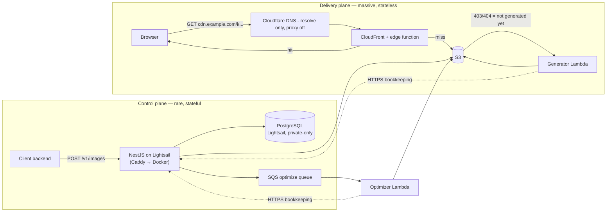
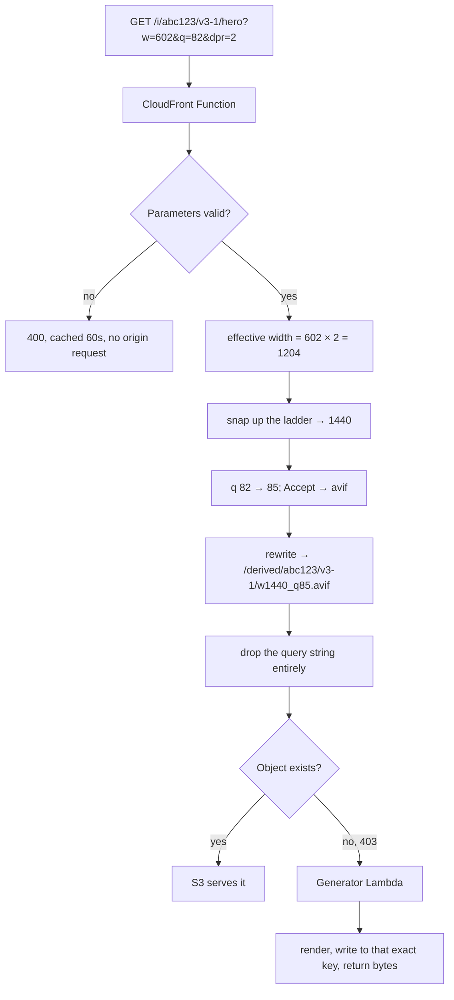
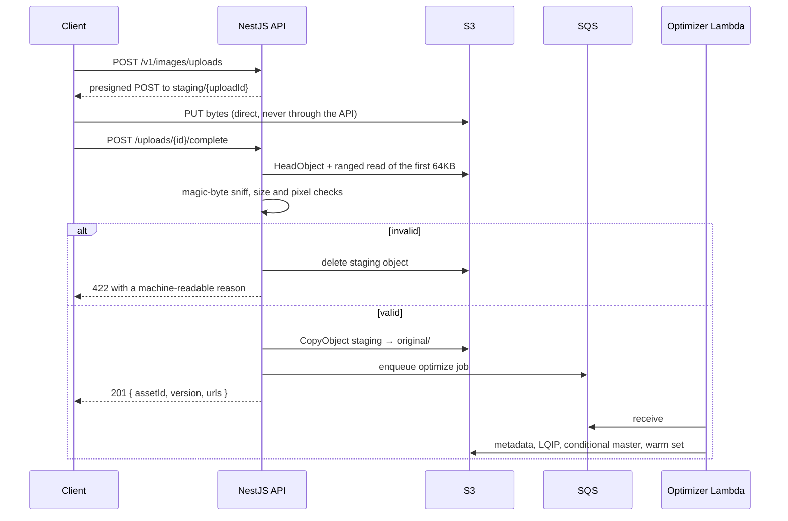

# Architecture

A self-hosted image optimization service: uploads in, optimized derivatives out,
served from a CDN. One deployment per consuming project.

The full decision record — seventeen numbered decisions with alternatives and
rationale — is [`design.md`](../openspec/changes/image-optimization-service/design.md).
This page is the shape of the thing.

## Two planes that never touch



**The Lambdas hold no database connection.** They record what they did by calling the
control plane, which is what keeps PostgreSQL reachable only from one host and what
lets both functions run outside a VPC — no NAT gateway, no interface endpoints. The
dotted arrows are the only path from the workers to the registry. See design.md L1 and
L2.

The separation is the load-bearing decision. The control plane is **never** in the
image read path, and the delivery path **never** queries PostgreSQL. That means an
outage of the database, the API, or the queue stops uploads while delivery continues
serving every image that already exists — which is almost all of them, almost all of
the time.

S3 object existence is the sole authority for whether a derivative can be served.
There is no "is it generated yet" lookup, because there is nothing to look it up in.

## The delivery path



Four things are happening here, and each one is doing real work:

**The query string is resolved into the path.** The rewritten path _is_ the cache
key, so `?w=602` and `?w=640` and `?w=639` all become one entry. Leaving the
parameters in the cache key would give the cache an unbounded number of entries and a
permanently cold hit ratio.

**Widths snap to a fixed ladder** (20 rungs, 16px to 3840px). Snapping _up_, never
down: serving 640px into a 602px slot costs ~13% extra bytes and looks correct;
serving 480px costs nothing and looks soft. This bound on the variant space is what
makes everything else affordable — storage, cache hit ratio, and Lambda spend all
track the number of _assets_, not the volume of traffic.

**Format is negotiated at the edge.** `Accept` is read once and baked into the path,
so one URL serves AVIF, WebP, or JPEG. The alternative — one URL with `Vary: Accept` —
fragments the cache by the full header string, and browsers send wildly varied ones.

**A miss fails over to the generator**, which renders the derivative, writes it to
that exact key, and returns the bytes. Every later request for that variant, globally
and forever, is a cache or S3 hit. The Lambda runs at most once per variant per asset
version.

## The ingest path



Two ingest modes exist because they solve different problems. A proxied multipart
upload is one request and simple; a presigned direct upload keeps large files off the
application server entirely. Both converge on the same invariant: **bytes land in a
private staging prefix, are validated there, and only then are promoted**. Nothing
under `staging/` is CDN-reachable, and a lifecycle rule expires it whether or not
anything else happens.

The upload response never waits on processing, and a failed enqueue never fails an
upload — the bytes are already durable at that point.

## Storage layout

```
staging/{uploadId}                              untrusted, expires in 24h, never CDN-reachable
original/{assetId}/{version}/source.{ext}       immutable, private, tiered down over time
master/{assetId}/{version}/master.webp          conditional intermediate for very large sources
derived/{assetId}/{version}/{canonical}.{ext}   the only prefix the CDN can read
```

Four prefixes with four trust levels. Originals are write-once: no code path reads an
object under `original/`, modifies it, and writes it back. Replacing source bytes
mints a new asset _version_ at a new key, which is also what makes URLs immutable.

## URLs never change meaning

Every delivery URL carries a version segment, `v{assetVersion}-{encoderEpoch}`:

- **`assetVersion`** advances when the source bytes are replaced. New URLs, new cache
  keys, no invalidation, and old URLs keep working until lifecycle reclaims them — so
  HTML already cached in a browser does not break.
- **`encoderEpoch`** is deployment-wide. Bumping it mints an entirely new URL space
  for every asset at once, with no per-asset write and no invalidation.

That second mechanism is what makes `Cache-Control: public, max-age=31536000,
immutable` safe to promise. Without it, "immutable" would mean "we can never change
our encoder settings".

CDN invalidation is reserved for deletions and takedowns. It is not part of the
normal content-change path.

## Where the money goes

Bandwidth is roughly 75% of the running cost. That single fact orders every other
decision:

- Modern-format adoption is the highest-leverage optimization in the system, which is
  why AVIF encoding effort is set high — encoding is paid once per variant, delivery
  is paid millions of times.
- Lambda micro-optimization is close to irrelevant by comparison.
- Because derivatives persist and the variant space is bounded, **compute tracks new
  assets, not traffic**.

Worked numbers are in design.md D16.

## Components

| Component          | Runs on         | Purpose                                                    |
| ------------------ | --------------- | ---------------------------------------------------------- |
| `apps/api`         | Lightsail       | Uploads, validation, metadata, lifecycle, worker callbacks |
| `apps/optimizer`   | Lambda (SQS)    | Metadata, LQIP, conditional master, eager warm set         |
| `apps/generator`   | Lambda (Fn URL) | On-miss generation                                         |
| `apps/maintenance` | Lightsail cron  | Orphan reconciliation, expiry, reaping, storage accounting |
| `infra/cloudfront` | CloudFront      | Edge normalizer, **generated** from `packages/core`        |
| `infra/cloudflare` | your laptop, CI | DNS records and ACM issuance — outside the CDK, see D18    |
| `packages/core`    | everywhere      | Transform grammar, ladder, canonical key. Zero AWS imports |
| `packages/client`  | consumer apps   | URL builder, srcset, React components, Next.js loader      |

## DNS sits in front, and only resolves

Names are managed in Cloudflare; AWS holds no hosted zone. The delivery hostname is a
`CNAME` onto the CloudFront distribution and the control-plane hostname is an `A` record
onto the instance's static IP, both with Cloudflare's **proxy switched off**.

That last part is load-bearing rather than a preference. Format negotiation happens at
the CloudFront edge: one URL returns AVIF, WebP or JPEG depending on the viewer's
`Accept` header, which is why every response carries `Vary: Accept`. Cloudflare's proxy
caches by URL and honours `Vary` only for `Accept-Encoding` — so a proxied record would
cache whichever format the first visitor received and hand it to everyone, including
AVIF to browsers that cannot decode it. The symptom is broken images for a subset of
users and nothing at all in the error metrics.

Certificates stay in ACM and are issued ahead of a deploy rather than by it, because
CloudFormation can only validate a certificate in a zone it owns. `infra/cloudflare`
does both jobs; see design.md D18.

## The failure mode to know about

`packages/core` defines the width ladder and canonical-key construction. The
CloudFront Function is **generated** from it, and a shared conformance suite replays
the same vectors against both.

That machinery exists because of one specific failure: if the edge and the core ever
disagree on normalization, CloudFront computes cache key A while the generator writes
object B. Every request misses. Every request invokes Lambda. The images are correct,
the status codes are 200, latency is normal — and **nothing appears in any error
metric**. The only symptoms are `OnDemandGenerations` failing to decay and a bill that
climbs with traffic.

Never hand-edit `infra/cloudfront/normalize.generated.js`. Edit the template, run
`pnpm --filter @imgopt/edge generate`, and commit the result.
