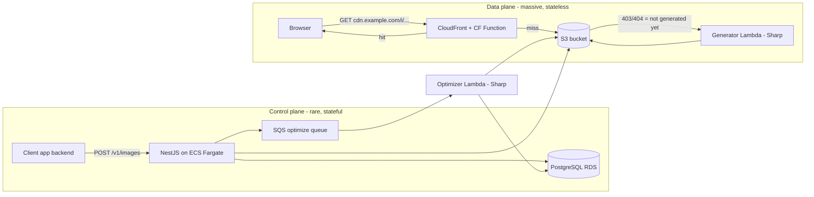
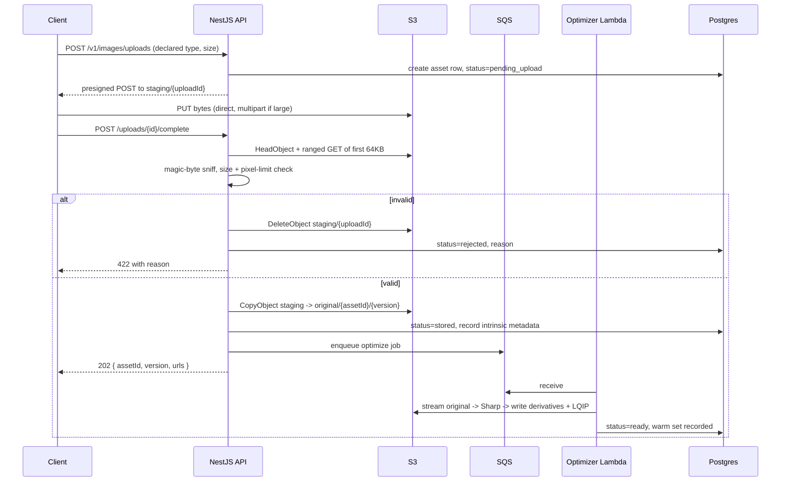
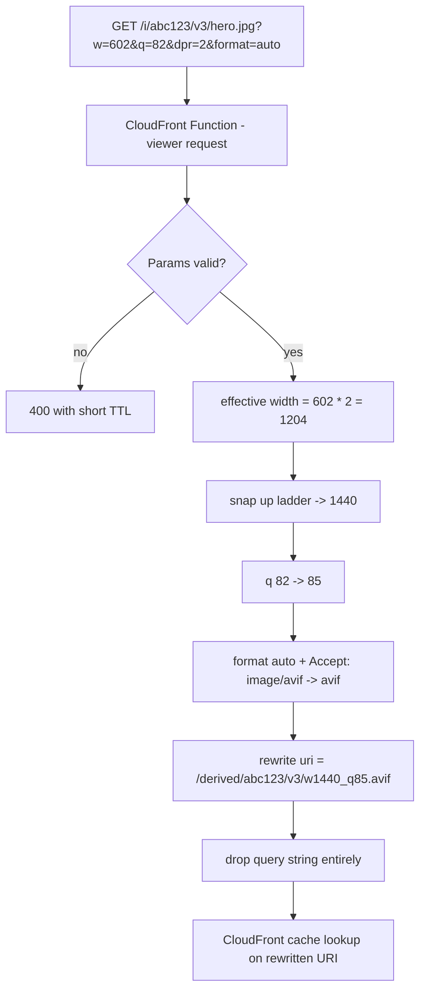
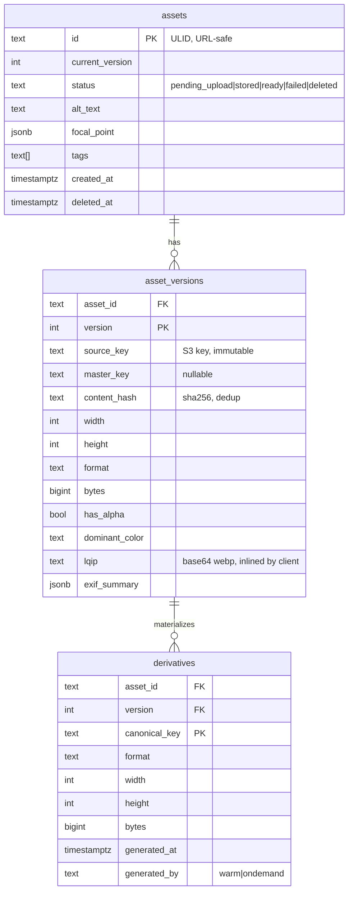

## Context

This repository is empty apart from OpenSpec scaffolding. Everything described here is greenfield.

The product being built is an **image optimization service deployed once per consuming project**: a NestJS control plane for ingest and metadata, an S3 + CloudFront data plane for delivery, and Sharp-in-Lambda for pixel work. It must behave like Cloudinary/Imgix from the outside — one URL, query parameters, instant delivery, automatic modern formats — while being simple enough that one engineer can operate it and cheap enough that cost grows sub-linearly with traffic.

Four decisions were fixed before design began and constrain everything below:

| Decision               | Choice                                                                       |
| ---------------------- | ---------------------------------------------------------------------------- |
| Control-plane hosting  | NestJS container on **ECS Fargate**                                          |
| Reuse model            | **One deployment per project** (single-tenant, no tenant dimension anywhere) |
| Cache-miss transform   | **CloudFront Function → S3 origin → Lambda failover**                        |
| Infrastructure as code | **AWS CDK (TypeScript)**                                                     |

Two forces shape every remaining decision:

1. **Bandwidth is the bill.** At any meaningful scale, CloudFront egress dwarfs S3 storage, Lambda, Fargate and RDS combined. The primary cost lever is therefore _bytes per delivered image_, not compute efficiency. This is why format negotiation and aggressive-but-tuned encoder settings matter more than shaving Lambda milliseconds.
2. **The variant space must be finite.** An image CDN that accepts arbitrary widths has an unbounded object count, an unbounded cache-key space, and therefore a permanently cold cache. Bucketing is not an optimization here — it is the structural property that makes the cost model work, and it is enforced at the edge so that unbucketed variants are _not representable_.

## Goals / Non-Goals

**Goals:**

- Uploads never fail because of file size. A 100MB source is stored durably before any processing is attempted.
- The original bytes are written exactly once and never mutated.
- p99 delivery latency for a cached image is CDN-bound (single-digit to low-tens of milliseconds), with no compute in the hot path.
- A finite, predictable number of S3 objects and CloudFront cache keys per asset.
- Every derivative is generated **at most once** for the lifetime of an asset version.
- Correct, modern output by default: AVIF/WebP negotiation, EXIF orientation applied, metadata stripped, sensible per-format quality.
- Consuming a project's images is a two-line change in a React/Next.js app.
- Standing up a new deployment is a config file plus `cdk deploy`.
- The whole thing is observable enough to debug a "why is this image blurry / missing / slow" report without SSH.

**Non-Goals:**

- Multi-tenancy. One deployment serves one project. No `tenant_id`, no per-tenant quotas, no tenant routing. Cross-project reuse happens by deploying another copy.
- Video, animated GIF/WebP transcoding.
- AI transformations: background removal, upscaling, auto-tagging, face detection beyond Sharp's built-in `attention`/`entropy` crop heuristics.
- A management UI. The API and CloudWatch are the interface.
- Non-AWS storage/CDN backends. Ports are defined so an adapter is possible, but no second adapter is built.
- Arbitrary user-supplied transformation chains (Cloudinary-style `e_*` effect pipelines). The parameter set is deliberately closed and small.

## Decisions

### D1 — Split the control plane from the data plane

**Decision:** NestJS on Fargate handles writes and metadata. It is _never_ in the image-read path. Reads are served by CloudFront from S3, with Lambda only on miss.

**Why:** These two paths have opposite requirements. Writes are rare, stateful, long-lived (100MB streaming multipart), need a database connection and benefit from a warm process. Reads are enormous in volume, stateless, and must not depend on a running container at all. Coupling them means the container's availability becomes the availability of every image on every page of every consuming app — an unacceptable blast radius for a service meant to sit under many projects.

**Alternatives considered:**

- _NestJS on Lambda for everything._ Rejected: API Gateway caps request payloads at 10MB (6MB for Lambda proxy integration), which breaks the "never fail on large uploads" goal unless all uploads become presigned-direct. Cold starts land on every admin call.
- _NestJS serving images directly from the container._ Rejected: puts a stateful, scale-limited component in the hot path of millions of requests and forfeits the CDN-native cache model.



### D2 — Two ingest modes, one storage guarantee

**Decision:** Support both a proxied upload and a presigned direct-to-S3 upload. Both converge on the same invariant: _bytes land in a private staging prefix, are validated, and only then are promoted to `original/` and registered as a usable asset._

- **Proxied** — `POST /v1/images` (multipart). Used for files under a configurable threshold (default 10MB). The container streams the request body straight into an S3 multipart upload while simultaneously hashing and sniffing the leading bytes. Nothing is buffered fully in memory or written to container disk.
- **Presigned direct** — `POST /v1/images/uploads` returns a short-lived presigned POST (or presigned multipart part URLs for very large files) targeting `staging/{uploadId}`. The browser or backend uploads straight to S3, never touching Fargate. `POST /v1/images/uploads/{id}/complete` finalizes.

**Why the staging prefix:** with direct-to-S3 you physically cannot validate before storage — the client writes to S3 without passing through your code. The staging prefix resolves the contradiction between "validate first" and "never fail on large files": untrusted bytes are stored in a location that is private, not CDN-reachable, lifecycle-expired after 24h, and never referenced by an asset record. Validation then runs on bytes that already exist durably, and promotion (`CopyObject` server-side, no download) is atomic and cheap.

Presigned POST policies carry a `content-length-range` condition and a `Content-Type` condition so S3 itself rejects oversized or wrong-typed uploads before a single byte of your quota is consumed.



**The original is immutable.** `original/{assetId}/{version}/source.{ext}` is written once. "Replacing" an image mints `version+1` and writes a new object; the old version's objects remain until lifecycle rules or an explicit purge remove them. There is no code path that reads an original, modifies it, and writes it back to the same key.

### D3 — Breakpoint bucketing, and how it actually works

This is the heart of the system, so it is specified precisely.

**Ladders.** Two ladders, not one:

```
DEVICE_WIDTHS = [320, 480, 640, 750, 828, 960, 1080, 1200, 1440, 1920, 2560, 3840]
ICON_WIDTHS   = [16, 32, 48, 64, 96, 128, 192, 256]
LADDER        = ICON_WIDTHS ++ DEVICE_WIDTHS   // sorted, 20 entries
```

The icon ladder matters more than it looks. Avatars, favicons, and thumbnail grids are extremely common, and snapping a 40px avatar up to 320px would ship ~60× the necessary bytes. A single ladder starting at 320 would quietly make the most numerous images on a typical page the most wasteful.

**The snapping algorithm.** Given a requested width `w`, a device pixel ratio `dpr`, and the source's intrinsic width `sw`:

```
1. effective = ceil(w * dpr)              // DPR folds into width; it is NOT a cache dimension
2. if effective > LADDER.max: effective = LADDER.max         // hard ceiling at 3840
3. bucket = smallest L in LADDER where L >= effective          // SNAP UP
4. emit bucket                                                 // this is the cache/object key
5. at render time only: output width = min(bucket, sourceWidth) // never upscale
```

Two rules with opposite directions, each for a reason:

- **Snap up (step 3)** because snapping down would deliver fewer pixels than the layout needs, and the browser would upscale — visible softness. Serving 640px for a 602px slot costs ~13% extra bytes and looks correct. Serving 480px for 602px costs nothing and looks wrong. Quality is not negotiable; a few percent of bytes is.
- **Cap at source width (step 5)** because generating a 3840px derivative from a 1000px original produces a strictly larger file with zero additional detail.

**The source cap applies to pixels, not to the key.** This is a correction made during implementation. The edge normalizer has no access to asset metadata — CloudFront Functions have no network, and CloudFront KeyValueStore tops out at 5MB total, far short of millions of assets — so it cannot know a source's intrinsic width. Folding the cap into the key would therefore require either a URL-embedded width hint or a second normalization path, and the hint approach is worse than the problem: URLs built without metadata (hand-written, curl, a CMS text field) would lack it and produce a _different key for the same image_, making cache fragmentation depend on who authored the URL.

So the canonical key is derived from the URL alone, identically at the edge and in the generator, and drift is structurally impossible. A request for `w=3840` against a 2000px source yields an object at key `w3840_…` whose contents are 2000px wide. The redundancy is bounded by the ladder, and the client SDK caps its `srcset` candidates at the intrinsic width, so well-behaved clients never request an oversized bucket in the first place. `snapWidth` still accepts an optional `sourceWidth` — that is the path the SDK uses.

Worked examples (key column is what both the edge and the generator compute; served column assumes a 2000px source):

| Request        | Effective | Snap up | Key bucket | Served pixels        |
| -------------- | --------- | ------- | ---------- | -------------------- |
| `w=602`        | 602       | 640     | **640**    | 640                  |
| `w=980`        | 980       | 1080    | **1080**   | 1080                 |
| `w=640`        | 640       | 640     | **640**    | 640                  |
| `w=641`        | 641       | 750     | **750**    | 750                  |
| `w=400&dpr=2`  | 800       | 828     | **828**    | 828                  |
| `w=1920&dpr=2` | 3840      | 3840    | **3840**   | 2000 (source-capped) |
| `w=40`         | 40        | 48      | **48**     | 48                   |
| `w=99999`      | 3840      | 3840    | **3840**   | 2000 (source-capped) |

**Height is not bucketed independently — the aspect ratio is.** Snapping height to the same ladder would distort images (a 640×481 request would become 640×640). Instead:

- `w` only → height is derived from the source aspect ratio. No height in the key.
- `h` only → snap `h` on the ladder, derive width.
- both → snap `w` to a bucket `W`, quantize the requested ratio `r = h/w` to the nearest entry in `RATIOS = [1/1, 4/3, 3/2, 16/9, 21/9, 3/4, 2/3, 9/16]` within a 3% tolerance; outside tolerance, round `r` to 2 decimals. Final `H = round(W * r)`.

This caps the two-dimensional space at `20 widths × ~2000 heights` instead of `20 × 3840`. The nine listed ratios cover the shapes anyone asks for by name; the two-decimal fallback is what keeps unusual crops expressible, and it is what actually sets the bound. `isQuantizedHeight` in `packages/core/src/breakpoints.ts` is the acceptance twin of that arithmetic and is deliberately a _superset_ of it — refusing a height the normalizer can emit would 400 a legitimate viewer URL forever, and only for shapes nobody types by hand. Tightening the bound means changing `quantizeRatio`'s rounding granularity, which is a grammar change: it must happen before anything is cached, and the acceptance twin has to move in the same commit.

**Everything else quantizes too.** A dimension that isn't quantized is a cache-fragmentation hole:

| Parameter    | Allowed values after normalization                                                                                                                                                   |
| ------------ | ------------------------------------------------------------------------------------------------------------------------------------------------------------------------------------ |
| `q`          | snap to nearest of `{50, 65, 75, 85, 95}` — a _perceptual_ scale, translated per codec at encode time                                                                                |
| `fit`        | enum: `cover \| contain \| inside \| outside \| fill \| pad`; `pad` is an accepted spelling that collapses to `contain` at parse time, since both reach the encoder as the same call |
| `format`     | `auto \| avif \| webp \| jpeg \| png`; `auto` resolves to a concrete format at the edge                                                                                              |
| `blur`       | snap to nearest of `{0, 2, 5, 10, 20, 40}`                                                                                                                                           |
| `sharpen`    | `{0, 1, 2}`                                                                                                                                                                          |
| `background` | lowercase 6- or 8-digit hex with each channel snapped to the 4-bit grid (`00, 11, … ff`); only meaningful with `fit=contain`. Unquantized, this axis alone is 2^24 keys per box      |
| `crop`       | named gravity only on the public URL: `center \| top \| bottom \| left \| right \| entropy \| attention`                                                                             |
| `dpr`        | `{1, 2, 3}` — folded into width, never appears in the key                                                                                                                            |

**Parameters that cannot affect the output are elided from the key.** A parameter that is present but inert is a cache-fragmentation hole exactly like an unquantized one: `?w=640` and `?w=640&fit=cover` produce identical pixels, so they must produce identical keys. Normalization drops:

- `fit` unless **both** dimensions are constrained — with only one, the resize is proportional and every fit mode yields identical pixels.
- `background` when `fit` never produces empty area — only `contain` can, and `pad` is a spelling of it.
- `crop` gravity on every fit but `cover`, the one fit that discards pixels. `outside` resizes past the requested box and returns the result whole, so sharp never crops it and every gravity yields identical bytes.
- `blur` and `sharpen` at level 0.
- `dpr`, always — it is folded into the width before snapping.
- any unrecognized parameter.

**Quality is perceptual, not a raw codec value.** The levels describe how an image should _look_; `encoder-options.ts` maps each onto per-codec settings, so nominal 75 becomes mozjpeg 78, WebP 72, and AVIF 50. Treating `q` as a raw codec number instead would mean a caller asking for the perfectly reasonable `?q=75` hands AVIF a near-lossless setting, producing files several times larger than needed and giving back most of what AVIF was adopted for — on the line item that is ~75% of the bill.

**Absolute pixel crops are deliberately not a public URL parameter.** `crop=x,y,w,h` reintroduces an unbounded key space through the back door — it is the one parameter that could single-handedly undo bucketing. Instead, arbitrary rectangles are performed through the authenticated API, which materializes the result as a **new asset** with its own id.

**There is no `crop=focal`, and the reason is the same one.** A focal point is registry metadata, and the delivery plane never reads the registry — the generator is handed a key and nothing else — so a stored point could not reach the render. It rendered as centre, which meant `crop=focal` minted a second key holding bytes identical to the elided centre key: fragmentation dressed as a feature. The value is still stored on the asset as advisory metadata for clients that position images themselves; putting it in the URL grammar again requires first deciding how it can reach the generator. This matches how the cost actually behaves: an arbitrary crop is a new image, not a rendition of an existing one.

**Canonical key construction.** After normalization, a deterministic path is built:

```
common case:   derived/{assetId}/{version}/w640_h360_cover_q75.avif
with extras:   derived/{assetId}/{version}/w640_h360_cover_q75_gtop_bgffaa00_bl5.avif
```

The readable prefix keeps S3 browsable during incident response. **The same function produces both the CloudFront cache key and the S3 object key** — they are the same string. Any divergence between them would mean CloudFront caching one thing and S3 storing another, so they are made structurally identical rather than kept in sync by discipline.

**Rare parameters are spelled out, not hashed.** This is a correction made during implementation. The original sketch collapsed `blur`, `sharpen`, `background`, and non-center gravity into a short base36 hash suffix to keep filenames bounded. That is one-way, and the generator (D5) is handed nothing but the rewritten path — the edge drops the query string, and the delivery plane may not query PostgreSQL — so a hashed tail would leave it knowing that extras existed but not which, unable to produce the bytes its own key names. Requests carrying any rare parameter would fail permanently.

Hashing turns out to buy nothing anyway: every one of these values is already quantized, so the tail has a hard maximum length without it. Gravity is an enum, background is 6 or 8 hex digits, and both effects are single levels, bounding the worst case at under 30 characters. Spelling them out keeps the invariant that **the key alone determines the bytes**, which is what makes the edge and the generator independently derivable from the same string. The alternative considered — keep the hash and have the edge pass the extras in an origin-request header excluded from the cache key — was rejected because it makes an object's contents depend on a channel outside its key, which is precisely the drift class this architecture is built to make impossible.



### D4 — The edge normalizer is generated code, not hand-written

**Decision:** The width ladder, quantization tables, and canonical-key builder live in `packages/core` as TypeScript. A build step compiles a subset into `infra/cloudfront/normalize.generated.js` for the CloudFront Function. A shared conformance test suite runs the same ~200 input/output vectors against the TypeScript implementation and the generated edge function.

**Why:** CloudFront Functions run a restricted JS runtime with a 10KB source limit and a ~2ms budget, so the edge code cannot simply import the shared package. That normally means two implementations of the same algorithm — and if they ever disagree, CloudFront computes cache key A while the Lambda writes object B. The result is a permanent 100% miss rate on that variant, with every request invoking Lambda, silently, forever. This is the single highest-severity failure mode in the whole architecture, and codegen plus shared vectors is the cheapest structural defense.

**Alternative considered:** do normalization only in the Lambda and let CloudFront cache on the raw query string. Rejected — it defeats the entire purpose: `?w=602` and `?w=640` would be separate cache keys again.

### D5 — Generate on miss via CloudFront origin failover

**Decision:** One CloudFront **origin group**: primary origin is the S3 bucket (via OAC), failover origin is the generator Lambda's Function URL. Failover criteria include `403` and `404`.

Flow: CF Function rewrites the URI to the canonical derivative path → CloudFront asks S3 for that exact key → if it exists, S3 serves it and CloudFront caches it → if it does not exist, S3 returns 403/404 → CloudFront transparently retries against the Lambda Function URL with the same path → Lambda parses the canonical path, loads the source, runs Sharp, **writes the derivative to that exact S3 key**, and returns the bytes. Every subsequent request for that variant — globally, forever — is served by S3 or the edge cache. Lambda runs once per variant per asset version.

**Implementation notes that matter:**

- With OAC and no `s3:ListBucket` permission, S3 returns **403, not 404**, for a missing key. Grant only `s3:GetObject` and configure failover on `403` (include `404` too for safety). Getting this backwards produces a 403 shown to users instead of a generated image.
- Origin failover only applies to `GET`, `HEAD`, `OPTIONS`. Images are all GET, so this is a non-issue here, but it forecloses any future POST-based transform endpoint on the same distribution.
- The Lambda Function URL is `AWS_IAM`-authenticated with OAC for Lambda URLs, so it is not independently reachable from the internet.
- The Lambda sets `Cache-Control: public, max-age=31536000, immutable` on both its HTTP response and the S3 object it writes, so the first (Lambda-served) response and all later (S3-served) responses are byte-identical in their caching semantics.

**Alternatives considered:**

- _Lambda@Edge on origin-request._ Lower miss latency for far-from-region viewers, but ~3× the cost, no environment variables, tighter size limits, slow global deploys and painful rollbacks, and Sharp's native binaries at edge are a recurring source of pain. Since a miss happens at most once per variant, optimizing miss latency is optimizing the rarest event.
- _S3 Object Lambda._ Charges per GB on _every_ request including hits, and complicates the CloudFront caching model. Wrong shape for a read-heavy CDN workload.
- _NestJS as the fallback origin._ Would work, but re-couples the container to the read path and scales badly under a thundering herd of misses.

### D6 — Hybrid generation: a small eager warm set, everything else lazy

**Comparison of the three strategies:**

|                    | Eager: all variants at upload            | Lazy: all variants on first request | **Hybrid (chosen)**                     |
| ------------------ | ---------------------------------------- | ----------------------------------- | --------------------------------------- |
| First-view latency | Best — always warm                       | Worst — 300ms–2s Sharp cold path    | Good — likely sizes warm, rest one-time |
| Compute cost       | Highest — pays for variants nobody views | Lowest — pays only for what's seen  | Low — small fixed cost + demand-driven  |
| Storage cost       | Highest — 20+ objects per asset always   | Lowest                              | Low                                     |
| Upload latency     | Bad if synchronous                       | Best                                | Best — async either way                 |
| Predictability     | Fully predictable                        | Spiky; herd on viral content        | Predictable + bounded spikes            |
| Failure visibility | At upload, easy to alert                 | At request time, user-visible       | At upload for the warm set              |
| Fit for UGC        | Terrible — most images never viewed      | Good                                | Good                                    |
| Fit for catalog    | Good                                     | Extra latency on cold products      | Good                                    |

**Decision:** generate a _configurable, deliberately small_ warm set at upload, lazily generate everything else on first request, and persist every lazily-generated derivative so it is never regenerated.

Default warm set:

- **LQIP** — a ~24px-wide, heavily-compressed WebP, base64-encoded and stored **in Postgres** (not S3). It is inlined into HTML by the client SDK for blur-up placeholders; a network round-trip for a 400-byte placeholder would defeat its purpose.
- **One primary width** in AVIF — the deployment's configured "most likely rendering width" (default 1080, capped at source width).
- Intrinsic metadata extraction: dimensions, format, colorspace, orientation, has-alpha, dominant color.

Everything else — the other 19 widths × 3 formats × ratios — is lazy. The knob exists because the right answer is workload-dependent: a product catalog where every image is viewed should widen the warm set; a UGC archive where 95% of uploads are never viewed should keep it at LQIP only.

**Why lazy generation is safe here:** because bucketing bounds the variant space, "lazy" cannot degrade into "regenerate forever." Each asset version has a finite ceiling of possible derivatives, each is generated at most once, and the steady state converges to a fully-warm cache for the sizes that are actually used.

### D7 — Master renditions: conditional, not always

**Decision:** generate a `master/` rendition **only when the original exceeds a threshold** (default: longest edge > 4000px, or file size > 20MB). Below the threshold, derivatives are generated directly from the original.

**Why not always:** a master tier for a 900KB JPEG is pure overhead — extra storage, extra Lambda invocation, extra failure mode, and the decode saving is negligible.

**Why not never:** with a 100MB 12000×8000px TIFF, _every_ cache miss decodes the full original. That's multi-second Lambda runs at high memory, meaning high GB-seconds and a real risk of timeouts. Materializing one 4000px-longest-edge master in a fast-decoding format converts every subsequent miss from "decode 96 megapixels" to "decode 8 megapixels" — roughly an order of magnitude less work, for the price of one extra object.

The master is a quality-preserving intermediate (high-quality WebP or mozjpeg q92, ICC preserved), not a delivery artifact. It is never served to clients.

Final prefix layout:

```
staging/{uploadId}                              # untrusted, 24h lifecycle, never CDN-reachable
original/{assetId}/{version}/source.{ext}       # immutable, private, Standard-IA after 30d
master/{assetId}/{version}/master.webp          # conditional, private
derived/{assetId}/{version}/{canonical}.{ext}   # public via CloudFront OAC only
```

There is no separate `optimized/` and `responsive/` split. That distinction exists in the prompt's sketch but has no operational meaning — both are derivatives addressed by the same canonical key scheme, and splitting them would mean two code paths and two lifecycle policies for one concept.

### D8 — Caching: immutable URLs, and never invalidate

**Decision:** version-addressed, immutable URLs. `Cache-Control: public, max-age=31536000, immutable` on every derivative. CloudFront invalidation is reserved for deletions and legal takedowns.

The version segment in the path is `{assetVersion}-{encoderEpoch}`:

- **`assetVersion`** increments when the source bytes are replaced. New URL, new cache key, zero invalidation, and old URLs keep working until their objects are lifecycle-expired — which means in-flight HTML referencing the old version doesn't 404.
- **`encoderEpoch`** is a deployment-wide integer bumped when encoder policy changes (e.g. lowering AVIF quality after a quality audit, or a Sharp/libvips upgrade that changes output). Bumping it mints an entirely new URL space for every asset at once, without a database write per asset and without a single invalidation. Old derivatives age out via lifecycle rules.

That second mechanism is the escape hatch that makes `immutable` safe to promise. Without it, "immutable" would mean "we can never change our encoder settings."

**When an image is regenerated:** only when (a) its canonical key has no S3 object — a genuine first request; (b) the source was replaced, minting a new `assetVersion`; (c) `encoderEpoch` was bumped; (d) an operator explicitly calls `POST /v1/images/:id/reprocess`. There is no TTL-based regeneration and no time at which a cached derivative is considered stale — the URL identifies the exact bytes.

**Header contract:**

| Response                     | Cache-Control                         | Notes                                                                |
| ---------------------------- | ------------------------------------- | -------------------------------------------------------------------- |
| Derivative, S3 hit           | `public, max-age=31536000, immutable` | plus `ETag` from S3, `Vary: Accept` when resolved from `format=auto` |
| Derivative, Lambda-generated | identical to above                    | first response must not differ from later ones                       |
| Invalid parameters           | `public, max-age=60` on a 400         | short so a fixed URL recovers fast                                   |
| Asset not found              | `public, max-age=60` on a 404         | short so a later upload to the same id is picked up                  |
| Generation failure           | `no-store` on a 502                   | never persist a failure                                              |

`Vary: Accept` does not affect CloudFront's cache key — the key is defined by the cache policy, and format is already baked into the rewritten path — but it is correct for browsers and intermediate proxies, and it is free.

**Browser cache** gets the full year. Because the URL changes when the bytes change, a stale browser cache is impossible by construction. This is strictly better than ETag revalidation: a revalidation still costs a round trip; an immutable URL costs nothing.

### D9 — Format negotiation happens at the edge, not the origin

**Decision:** the CloudFront Function reads the viewer's `Accept` header and resolves `format=auto` to a concrete format _in the rewritten path_.

```
Accept contains image/avif  -> avif
else contains image/webp    -> webp
else                        -> jpeg
```

**Why at the edge:** the alternative is `Vary: Accept` on a single URL, which fragments the CloudFront cache by the _full_ Accept header string — and browsers send wildly varied Accept headers, so the effective cache-key cardinality explodes. Resolving to a concrete format at the edge collapses it to at most three branches per variant, with each branch being a normal, fully-cacheable object.

AVIF is ~30–50% smaller than JPEG at equivalent perceptual quality and ~20% smaller than WebP. Given that bandwidth is the dominant cost line, this decision is simultaneously the largest cost optimization and the largest performance improvement in the system. It is also why AVIF encoding effort is set high (slow encode, small file): encoding is a one-time cost paid once per variant, delivery is paid millions of times.

**`auto` never resolves to PNG, and that follows from D3 rather than being an oversight.** The original sketch had `auto` fall back to PNG for transparent sources. The edge cannot do it: it has no asset metadata — no network, and a KeyValueStore cannot hold per-asset alpha for millions of assets — and the key has to be derivable from the URL alone, identically at the edge and in the generator, or the two drift. So a client advertising neither modern format receives JPEG, with transparency flattened onto the background colour by the pipeline. Both modern formats carry alpha, so this affects only genuinely legacy clients, and `format=png` remains available to any caller that needs alpha preserved for them.

### D10 — Sharp configuration and Lambda sizing

**Pipeline order** (order is load-bearing — `rotate()` before `resize()`, metadata stripped last):

```
sharp(input, { limitInputPixels: 100_000_000, failOn: 'truncated', sequentialRead: true })
  .rotate()                                   // applies EXIF orientation, then drops the tag
  .resize({ width, height, fit, position, background, withoutEnlargement: true })
  .modulate(...) / .blur(sigma) / .sharpen()  // only when requested
  .toColorspace('srgb')                       // normalize; keeps colors correct across displays
  .toFormat(fmt, encoderOptionsFor(fmt))      // metadata dropped by default
```

- `.rotate()` with no argument must come **before** resize, or a portrait photo with EXIF orientation 6 gets resized against its stored (landscape) dimensions and comes out wrong.
- Metadata is stripped by default — this removes GPS coordinates from user photos (a genuine privacy leak) and typically 10–50KB per image. The ICC profile is the exception: converting to sRGB and _not_ attaching a profile is correct and smaller; attaching the original wide-gamut profile without conversion would render wrong on most displays.
- `limitInputPixels` is the decompression-bomb defense. A 30KB PNG can decode to 100,000×100,000 pixels — 40GB of RAM. This cap is non-negotiable.

**Lambda runtime:** Node 22 on **arm64/Graviton** (~20% cheaper per GB-second, and Sharp ships prebuilt `linux-arm64` binaries). Memory 3008MB as the starting point (the deployed default — see `docs/tuning.md`), tuned with AWS Lambda Power Tuning before launch. Lambda allocates vCPU proportionally to memory — 1769MB ≈ 1 full vCPU — and because Sharp's work is CPU-bound, _more memory is frequently cheaper overall_: doubling memory can more than halve duration, so GB-seconds go down while latency improves. Sizing this by intuition rather than measurement reliably picks wrong.

**Sharp concurrency:** `sharp.concurrency(1)` and `sharp.cache(false)` in Lambda. libvips defaults its thread pool to the core count, but a Lambda handling one image at a time gets no benefit from intra-image parallelism at low vCPU counts, and the thread pool plus libvips' operation cache both inflate memory across warm invocations — which is how a Lambda that passes testing OOMs in production a week later. The Fargate container, which may process several images concurrently, uses different settings.

**Cold starts:** the Sharp + libvips bundle is ~30MB, giving cold starts in the several-hundred-millisecond range. Mitigations: esbuild bundling with Sharp's binaries in a Lambda layer, module-scope Sharp initialization so it warms during init (billed init time on managed runtimes is free), and **no provisioned concurrency**. Provisioned concurrency would mean paying continuously to accelerate an event that, by design, happens once per variant. If p99 miss latency ever becomes a real complaint, the correct fix is widening the warm set, not paying for idle Lambdas.

### D11 — PostgreSQL for metadata, and no Redis

**Postgres (RDS, Prisma ORM + Prisma Migrate).**

This reverses an earlier draft of this decision, which chose Drizzle on the grounds that Prisma's Rust query engine added tens of megabytes and meaningful cold-start cost to Lambdas that need to stay small. **Prisma 7 removed the Rust query engine**: queries are compiled in TypeScript and issued through a driver adapter (`@prisma/adapter-pg`), so the original objection no longer holds. Verified during implementation — the generated client is ~390KB of TypeScript with no native binary anywhere in the runtime path; the 22MB `@prisma/engines` package is a CLI-only devDependency that is never shipped.

What remains true is that Prisma's client is larger than Drizzle's and its generated types are heavier. The residual risk is bundle size after tree-shaking rather than a native binary, and it is measured at task 7.1 when esbuild bundling exists. If a Lambda bundle turns out to be unacceptable, the escape hatch is narrow: the generator Lambda's only database work is best-effort derivative bookkeeping, which can be dropped entirely without affecting delivery.

Prisma also buys things that matter for a service meant to be picked up years later: a single declarative schema file that reads as documentation, generated migrations with a checked-in history, and `prisma studio` for inspecting an environment without writing SQL.

Two Prisma 7 details that bite on first contact: the connection URL no longer lives in the schema's `datasource` block (it moves to `prisma.config.ts` for the CLI, and to a driver adapter for the runtime client), and clearing a nullable JSON column requires `Prisma.DbNull` rather than `null`, which would otherwise be ambiguous with storing a JSON `null`.

Schema (single-tenant — no tenant column anywhere):



The `derivatives` table is bookkeeping, not a lookup path — **the delivery path never queries the database**. S3's own object existence is the source of truth for "does this variant exist." The table exists for cost attribution, orphan GC, and answering "what did we actually generate for this asset." Writes to it from the generator Lambda are best-effort and asynchronous; if they fail, delivery is unaffected.

**Redis is not adopted.** Each candidate job it might do already has a better-fitting home:

| Candidate use                      | Why not Redis                                                                                              |
| ---------------------------------- | ---------------------------------------------------------------------------------------------------------- |
| Job queue                          | SQS is managed, durable, has native DLQ and Lambda event-source integration, costs ~nothing at this volume |
| Caching derivatives                | CloudFront is the cache; a Redis layer behind it would serve almost no traffic                             |
| Caching metadata                   | The delivery path doesn't read metadata at all                                                             |
| Rate limiting across Fargate tasks | AWS WAF rate-based rules handle this at the edge without shared state                                      |
| Duplicate-work suppression         | Handled by S3 conditional writes (below)                                                                   |

Adding Redis would mean an ElastiCache cluster, VPC wiring, failover semantics, and a new outage mode — for no capability the system lacks. The conditions that would change this: needing precise per-API-key quotas with atomic counters, or adding a workflow requiring distributed locks that S3 conditional writes can't express.

**Thundering herd on cache miss.** When a popular page ships new HTML referencing an uncached variant, hundreds of concurrent requests can miss simultaneously and each invoke the generator. Handled in layers: (1) CloudFront **origin shield** collapses concurrent requests for the same key into a single origin fetch — this alone resolves most of it; (2) the generator uses S3 `PutObject` with `IfNoneMatch: *` so concurrent generators race harmlessly, with the loser discarding its output; (3) reserved concurrency on the generator Lambda caps worst-case spend. No distributed lock, no Redis.

### D12 — Security

| Threat                                  | Control                                                                                                                                                                                                                     |
| --------------------------------------- | --------------------------------------------------------------------------------------------------------------------------------------------------------------------------------------------------------------------------- |
| Wrong/spoofed content type              | Magic-byte sniffing with `file-type` on the first 64KB; declared `Content-Type` is never trusted. Mismatch → reject.                                                                                                        |
| Decompression bomb                      | `limitInputPixels: 100_000_000` in Sharp; pixel dimensions checked from headers before full decode.                                                                                                                         |
| Oversized upload                        | `content-length-range` in the presigned POST policy — S3 rejects it, so the bytes never become your problem.                                                                                                                |
| Malicious SVG (XXE, embedded JS)        | **SVG rejected by default.** If enabled by config, it is sanitized and always rasterized; the raw SVG is never served from the CDN.                                                                                         |
| Polyglot files (valid GIF + valid HTML) | Every delivered byte is Sharp re-encoded output, never passthrough. `X-Content-Type-Options: nosniff` on all responses.                                                                                                     |
| Malware in stored originals             | GuardDuty Malware Protection for S3 on the `staging/` prefix — managed, no ClamAV layer to maintain. Findings quarantine the object and mark the asset rejected. ClamAV-in-Lambda documented as the air-gapped alternative. |
| EXIF GPS leakage                        | Metadata stripped from all derivatives; `original/` is never publicly reachable.                                                                                                                                            |
| Bucket exposure                         | Block Public Access on, no bucket policy granting `*`, CloudFront OAC is the only read principal, and only for `derived/*`.                                                                                                 |
| Variant-flooding DoS                    | Bucketing bounds the reachable variant space; the CF Function rejects unparseable params at the edge before any origin cost. Signed URLs are therefore _optional_, not load-bearing.                                        |
| Write-endpoint abuse                    | API-key auth on all writes, WAF rate-based rules on the ALB, per-key upload quotas enforced in Postgres.                                                                                                                    |
| Private images                          | Supported via CloudFront signed URLs/cookies on a separate cache behavior; off by default since the common case is public assets.                                                                                           |

The important structural point: **bucketing is a security control, not just a cost control.** In a system that accepts arbitrary widths, an attacker generates unbounded Lambda invocations and unbounded S3 objects with a trivial loop. Here, the total reachable object count per asset version is a small constant, so the same loop hits cached objects almost immediately.

### D13 — API surface

Control plane (authenticated, `api.example.com`):

```
POST   /v1/images                       multipart proxied upload (small files)
POST   /v1/images/uploads               -> presigned target + assetId
POST   /v1/images/uploads/:id/complete  validate, promote, enqueue
GET    /v1/images/:id                   metadata + delivery urls + srcset + lqip
GET    /v1/images/:id/variants          materialized derivatives (ops/cost visibility)
PATCH  /v1/images/:id                   alt text, tags, focal point
PUT    /v1/images/:id/source            replace bytes -> new assetVersion
POST   /v1/images/:id/reprocess         re-run warm set
DELETE /v1/images/:id                   soft delete, purge S3, invalidate CDN
GET    /healthz  /readyz                ALB + ECS health checks
```

Delivery plane (public, `cdn.example.com`):

```
GET /i/{assetId}/{version}/{slug}?w=&h=&q=&fit=&format=&crop=&background=&blur=&sharpen=&dpr=
```

`{slug}` is SEO decoration — the CF Function drops it during normalization, so `/i/abc/v3/red-shoes` and `/i/abc/v3/chaussures-rouges` collapse to one cache key.

**Extensibility rule:** new parameters must be _additive with an identity default_. A parameter whose default value produces the same canonical key as its absence can be added without invalidating a single cached URL. A parameter that changes the key for existing URLs requires an `encoderEpoch` bump. This rule is what keeps a closed parameter set from becoming a straitjacket.

### D14 — Project structure

pnpm workspace monorepo. The critical structural property is that `packages/core` — which owns the transform grammar, the ladder, and canonical-key construction — is depended on by the API, both Lambdas, the client SDK, and the CloudFront Function codegen. There is exactly one definition of what a URL means.

```
apps/
  api/                          NestJS control plane -> Docker -> Fargate
    src/
      modules/
        upload/                 proxied + presigned ingest, validation
        assets/                 registry, lifecycle, versions
        delivery/               URL building, srcset generation
        storage/                S3 adapter behind StoragePort
        queue/                  SQS adapter behind QueuePort
        health/
      common/                   filters, interceptors, guards, logging
      config/                   zod-validated env schema
      main.ts
  optimizer/                    SQS-triggered Lambda: warm set + metadata + master
  generator/                    Function URL Lambda: on-miss generation
packages/
  core/                         DOMAIN. transform spec, breakpoints, canonical key,
                                format policy, sharp pipeline. Zero AWS imports.
  client/                       JS SDK: url builder, srcset, React + Next.js
infra/
  cdk/                          stacks: network, storage, cdn, compute, data, observability
  cloudfront/normalize.generated.js
```

`packages/core` having **zero AWS imports** is what makes the transform algorithm unit-testable in milliseconds without mocks or LocalStack, and it is what allows the same code to run in a container, in Lambda, and in a browser SDK. Storage and queue access sit behind ports so local development runs against MinIO and ElasticMQ.

### D15 — Frontend integration

The client package's job is to make correct responsive images the _easy_ path.

**`srcset` from the ladder.** The SDK emits candidates from the same ladder the service buckets to, capped at source width — so every candidate a browser can pick is guaranteed to be a warm or cheaply-generable variant, and no candidate is an upscale:

```html

```

`width`/`height` come from stored intrinsic metadata and are always emitted — they reserve layout space and prevent CLS, which is a Core Web Vitals score, not a nicety.

**`<picture>` is not needed** for AVIF/WebP fallback, because format negotiation happens server-side from `Accept`. This is a real advantage over static file serving: one URL, no markup branching, and a browser that later gains AVIF support starts receiving AVIF with no code change. `<picture>` remains available for art direction (genuinely different crops per breakpoint), which is the case it actually exists for.

**Next.js** integrates through a custom loader, so `next/image` keeps its layout and lazy-loading behavior while delegating optimization to this service — which also removes image transformation from the Next.js server's own workload.

**Above-the-fold images** get `priority` / `fetchpriority="high"` and a `<link rel="preload" as="image" imagesrcset=... imagesizes=...>`; everything else gets `loading="lazy"`. The LQIP from Postgres is inlined as a base64 background for blur-up, costing zero extra requests.

### D16 — Cost model

Illustrative steady state: 1M assets (avg 2MB original), 5 materialized derivatives each at ~110KB, 50M image requests/month, 95% edge hit rate. Approximate US/EU list prices; regional and subject to change.

| Line item                | Basis                                | ~Monthly                     |
| ------------------------ | ------------------------------------ | ---------------------------- |
| **CloudFront egress**    | 50M × 110KB ≈ 5.2TB @ ~$0.085/GB     | **~$450**                    |
| CloudFront requests      | 50M @ ~$0.0075/10k                   | ~$38                         |
| S3 storage — originals   | 2TB, Standard-IA after 30d @ $0.0125 | ~$25                         |
| S3 storage — derivatives | 550GB Standard @ $0.023              | ~$13                         |
| Lambda generation        | 5M one-time gens, 700ms @ 2GB arm64  | ~$95 **one-time**, amortized |
| ECS Fargate              | 2 × 0.5vCPU/1GB tasks, always on     | ~$30                         |
| RDS Postgres             | db.t4g.micro Multi-AZ                | ~$30                         |
| SQS, CloudWatch, WAF     |                                      | ~$15                         |

Three things this table shows:

1. **Egress is ~75% of the bill.** Therefore AVIF is the single highest-leverage optimization in the system: 30–50% smaller than JPEG translates almost directly into 30–50% off the largest line item. A week spent tuning encoder settings pays for itself repeatedly; a week spent shaving Lambda milliseconds does not.
2. **Compute is not a recurring cost.** Because derivatives persist and the variant space is bounded, Lambda spend tracks _new assets_, not _traffic_. Traffic can grow 10× with Lambda spend flat. In a naive per-request-transform service, that same 10× multiplies the compute bill.
3. **S3→CloudFront transfer is free**, so origin fetches cost only request charges — which is why "let CloudFront miss to S3" is an acceptable design rather than something to engineer around.

Additional controls: lifecycle rules move originals to Standard-IA at 30 days and Glacier Instant Retrieval at 180; derivatives for superseded `assetVersion`s expire after a grace period; `staging/` expires at 24 hours; an EventBridge-scheduled GC job reconciles S3 against the `derivatives` table to remove orphans; CloudFront price class is configurable to exclude expensive regions when the audience is regional.

### D17 — Observability

**Structured logging** — pino JSON to CloudWatch, with a correlation id generated at ingest and propagated through the SQS message attributes into the Lambda, so a single `assetId` filter reconstructs the whole lifecycle across three compute environments.

**Custom metrics via CloudWatch EMF** (embedded in log output — no separate `PutMetricData` call, no added latency):

| Metric                                         | Why it matters                                                                                                                                                                 |
| ---------------------------------------------- | ------------------------------------------------------------------------------------------------------------------------------------------------------------------------------ |
| `GenerationLatency` p50/p99 by format & bucket | Detects encoder regressions and pathological sources                                                                                                                           |
| `GenerationFailures` by reason                 | Distinguishes corrupt input from real bugs                                                                                                                                     |
| `OnDemandGenerations`                          | **The health signal.** Should trend to near-zero per asset. Sustained non-zero means normalization drift — a CF-Function-vs-core mismatch that silently invokes Lambda forever |
| `BytesServed` by format                        | Direct proxy for the dominant cost line; tracks AVIF adoption                                                                                                                  |
| `QueueDepth` / `ApproximateAgeOfOldestMessage` | Backlog detection before users notice                                                                                                                                          |
| `DLQDepth`                                     | Any non-zero value is an alarm                                                                                                                                                 |
| CloudFront `CacheHitRate`                      | Below ~90% means fragmentation somewhere                                                                                                                                       |
| `UploadRejections` by reason                   | Security signal and client-integration bug signal                                                                                                                              |

**Alarms:** DLQ depth > 0; queue age > 15min; generation failure rate > 1%; cache hit rate < 85%; 5xx rate at CloudFront; ECS task health.

**Tracing:** AWS X-Ray across API → SQS → Lambda → S3. Notably, the _delivery_ path is deliberately untraced — X-Ray on 50M cache hits would cost more than the images.

**Dashboard:** a single CloudWatch dashboard with delivery health (hit rate, 4xx/5xx, latency), pipeline health (queue depth, DLQ, failures), cost proxies (bytes served, GB-seconds, object count), and business volume (uploads, assets, storage growth).

### D18 — DNS in Cloudflare; certificates pre-issued, never created by CloudFormation

**Decision:** DNS and domain management live in **Cloudflare**. Route 53 is not used
anywhere. CloudFront remains the CDN and ACM remains the certificate authority, but
certificates are requested _before_ a deploy by `infra/cloudflare` and passed into the
CDK as ARNs. The CDK creates no DNS records and issues no certificates; it publishes
the hostnames its resources answer to (`CdnDnsTarget`, `ApiDnsTarget`) as stack
outputs instead.

```text
Cloudflare DNS
      ↓  (CNAME, proxy off)
AWS CloudFront   ← ACM certificate, us-east-1
      ↓
S3 (derived/ only, via OAC)
```

**Why certificates cannot be created in the stack.** DNS-validated issuance requires a
validation record to appear in the zone. CloudFormation can write that record only for
a Route 53 zone it owns. Point the same construct at an external zone and the stack
does not fail — it _waits_, holding the deployment open until CloudFormation gives up
hours later. A deploy that hangs is worse than one that fails, so issuance moves ahead
of the deploy and the ARN becomes an input. It also means the certificate outlives any
`cdk destroy`, which is the right lifetime for something with a renewal schedule.

**Why the proxy must stay off.** Cloudflare's proxy is a second CDN in front of
CloudFront, and it caches by URL while honouring `Vary` only for `Accept-Encoding`.
Format negotiation here happens at the CloudFront edge (D9): one URL returns AVIF,
WebP or JPEG depending on `Accept`, and every response carries `Vary: Accept`. An
orange-clouded record would cache whichever format the first visitor received and
serve it to everyone — AVIF to browsers that cannot decode it, presenting as a broken
image for a subset of users with nothing in any log to explain it. It would also
detach CloudFront's cache-hit metrics from what viewers actually experience, which is
one of only two detectors for normalization drift (D4). The reconciler in
`infra/cloudflare` treats a proxied record as a change to undo, not a preference.

**Why the tooling is a separate package.** Keeping it inside the CDK app would mean
either a Cloudflare custom resource — a Lambda holding a zone-editing token, invoked
by CloudFormation, in the deploy path — or a hand-copied hostname that goes stale the
first time a stack is replaced. A small reconciler that reads stack outputs and diffs
against the zone is less machinery and fails in the open: it prints a plan and writes
nothing without `--apply`.

**Alternatives considered.**

- **Route 53 (the original design).** Fully automatic: certificate issuance,
  validation, and alias records in one deploy. Rejected because the domain is managed
  in Cloudflare; delegating the zone to Route 53 to regain the automation would move
  the whole domain, which is a larger decision than this system deserves to force.
- **Cloudflare proxy in front of CloudFront.** Would add WAF and analytics at the
  edge, but breaks format negotiation as above, and doubles the CDN bill for a
  workload whose entire cost model is bandwidth (D16).
- **A Cloudflare Terraform provider.** Correct in a shop that already runs Terraform;
  here it would introduce a second IaC toolchain and a second state file for three
  DNS records.
- **Cloudflare R2 instead of S3.** Out of scope: it would replace the storage layer,
  the OAC trust model, and the failover-to-Lambda mechanism that D5 rests on.

**Consequences.**

- Two certificate ARNs are deployment inputs; production synthesis fails without the
  API one (see the TLS requirement in `specs/platform-security`).
- DNS is reconciled _after_ a deploy, not during it — a two-phase bootstrap.
- ACM validation records are permanent. Deleting one after issuance breaks renewal
  silently, roughly eleven months later.
- Nothing in the delivery path depends on Cloudflare beyond name resolution, so the
  DNS provider can change again without touching the architecture.

## Risks / Trade-offs

- **Edge/core normalization drift** → the highest-severity failure mode. A mismatch means CloudFront caches key A while Lambda writes object B: permanent 100% miss, every request invoking Lambda, no error anywhere. _Mitigation:_ generate the edge function from `packages/core` (D4), run shared conformance vectors against both in CI, and alarm on `OnDemandGenerations` staying non-zero — the symptom is invisible in error rates but obvious in that one metric.

- **Snap-up wastes bytes at ladder gaps** → a 1081px request serves 1200px, ~22% more pixels than needed. _Mitigation:_ accepted deliberately. The gaps are widest where pixel density is highest and the visual cost of downscaling is lowest. Tightening the ladder trades bytes-per-image against cache fragmentation, and fragmentation is the more expensive failure.

- **`immutable` + a bad encoder setting = a year of bad cached images** → _Mitigation:_ `encoderEpoch` (D8) mints a fresh URL space instantly, deployment-wide, without per-asset writes or invalidations. Requires consuming apps to re-render URLs via the SDK rather than hardcoding them — which the SDK exists to enforce.

- **A proxied Cloudflare record silently breaks format negotiation** → one cached
  format served to every viewer, including AVIF to browsers that cannot decode it,
  with nothing in any error metric. _Mitigation:_ the reconciler in `infra/cloudflare`
  turns the proxy off rather than reporting it, a unit test pins the rule, and D18
  records why.
- **A deleted ACM validation record breaks renewal ~11 months later** → an expired
  certificate on a date nobody is watching. _Mitigation:_ the record carries a comment
  saying it is permanent, and the certificate runbook says so twice.
- **Origin failover returns 403 not 404 under OAC** → misconfiguring the failover status codes shows users a 403 instead of generating their image. _Mitigation:_ include both 403 and 404 in the failover criteria; an integration test asserts that an ungenerated variant returns 200 with correct bytes.

- **Thundering herd on newly-published popular content** → hundreds of concurrent misses for the same key. _Mitigation:_ origin shield collapses them; `IfNoneMatch: *` conditional writes make concurrent generation harmless; reserved concurrency caps spend (D11).

- **Fargate baseline cost at zero traffic** → ~$60/month for ECS + RDS even for an idle deployment, which is real friction for the "deploy a copy per project" model on small projects. _Mitigation:_ documented as accepted; the delivery plane is fully serverless, so a future "lite" profile could run the control plane on Lambda with presigned-only uploads and Aurora Serverless v2 scaled to zero. Not built now.

- **One deployment per project multiplies operational surface** → N stacks to patch, N Sharp upgrades, N certificate renewals. _Mitigation:_ CDK constructs keep stacks identical and upgrades mechanical; versioned releases of the whole stack; ACM auto-renews. Accepted as the cost of hard isolation.

- **Sharp's native binaries differ across container/arm64-Lambda/local-macOS** → the classic "works locally, `Something went wrong installing the sharp module` in Lambda." _Mitigation:_ pin platform-specific optional dependencies explicitly, build Lambda artifacts in a container matching the runtime, and smoke-test the deployed Lambda in CI rather than trusting local tests.

- **AVIF encoding is slow** → high-effort AVIF can take seconds on large images, risking Lambda timeouts. _Mitigation:_ effort tuned per size bucket (lower effort above 1920px), 30s timeout with fallback to WebP on timeout, and the master rendition (D7) bounding decode cost.

- **The parameter set is deliberately closed** → some future need won't be expressible. _Mitigation:_ the additive-with-identity-default extension rule (D13) allows growth without cache invalidation; arbitrary crops route through asset creation, which is the honest model of their cost.

## Migration Plan

Greenfield — no data migration. Rollout is phased so each phase is independently verifiable:

- **Phase 0 — Foundations.** Monorepo, TypeScript config, lint/format, CI, zod-validated config, docker-compose local stack (Postgres + MinIO + ElasticMQ).
- **Phase 1 — Core domain.** `packages/core`: transform grammar, ladder, snapping, quantization, canonical key, format policy. Property-based tests plus the conformance vector suite. No AWS. _This phase de-risks the highest-severity failure mode before any infrastructure exists._
- **Phase 2 — Ingest & registry.** NestJS app, both upload modes, validation, Postgres schema and migrations, asset lifecycle endpoints.
- **Phase 3 — Processing.** Sharp pipeline in `packages/core`, optimizer Lambda, SQS + DLQ, warm set, LQIP, conditional master.
- **Phase 4 — Delivery.** CDK: S3 + OAC, CloudFront + origin group, generated CF Function, generator Lambda with Function URL, ACM + custom domain. End-to-end: upload → URL → correct bytes → second request served from S3.
- **Phase 5 — Client SDK.** URL builder, srcset/sizes, React component, Next.js loader, upload helpers, LQIP blur-up.
- **Phase 6 — Hardening.** WAF, GuardDuty malware protection, API-key auth, quotas, signed URLs, private-asset behavior.
- **Phase 7 — Operations.** EMF metrics, dashboard, alarms, X-Ray, lifecycle rules, orphan GC, `encoderEpoch` runbook, deployment documentation.

**Rollback:** every phase before 4 is invisible to consumers. From phase 4 on, CloudFront distribution config and CF Function versions roll back independently and quickly; `cdk deploy` of a prior tag restores compute. The database is additive-only during initial build, so no down-migrations are needed. Since derivatives are content-addressed by canonical key, a rollback never corrupts stored objects — at worst it stops generating new ones.

## Open Questions

1. **Warm-set width for the first consuming project** — the 1080px default is a guess until a real workload exists. Resolve by shipping with LQIP + 1080 AVIF and reading `OnDemandGenerations` by bucket after two weeks of production traffic.
2. **Is the icon ladder's lower bound right at 16px?** Below ~32px, encoder overhead dominates and AVIF can exceed PNG in size. May need a format-policy exception for very small dimensions.
3. **Quality ladder granularity** — five levels `{50,65,75,85,95}` may be coarser than needed for photography-heavy consumers. Widening is cheap; narrowing later is an `encoderEpoch` bump.
4. **`assetVersion` retention window** — how long do superseded versions' derivatives survive before lifecycle expiry? Too short breaks in-flight cached HTML; too long wastes storage. Starting proposal: 30 days.
5. **Does the deployment need a VPC with NAT?** RDS and Fargate want private subnets; NAT Gateway is ~$32/month plus data processing, which is significant against a ~$60 baseline. VPC endpoints for S3/SQS avoid most NAT traffic — needs costing during Phase 4.
6. **Per-key quota enforcement mechanism** — Postgres counters are simplest but race under concurrency. If exact quotas turn out to matter, this is the one requirement that could justify revisiting the no-Redis decision (D11).
